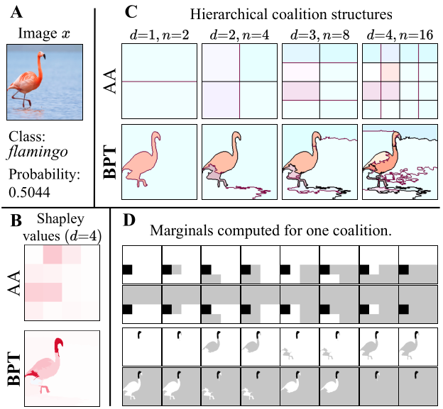
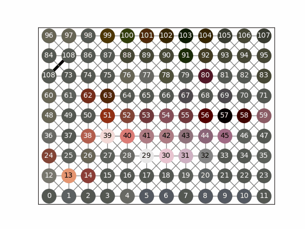
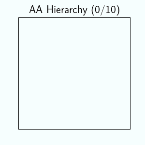
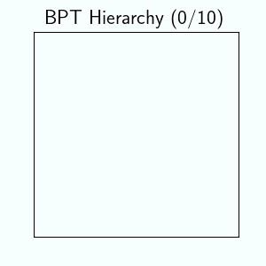
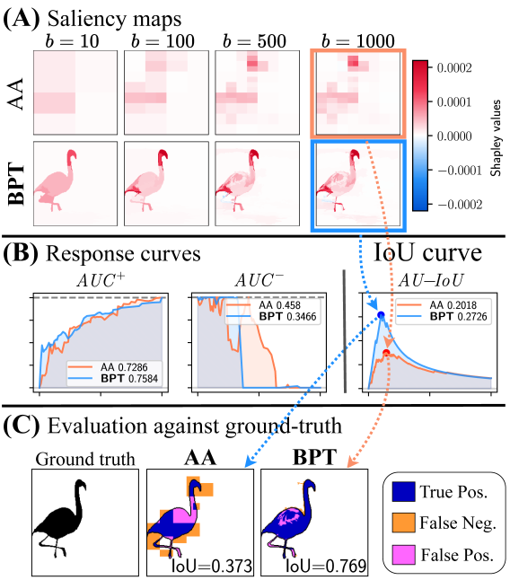
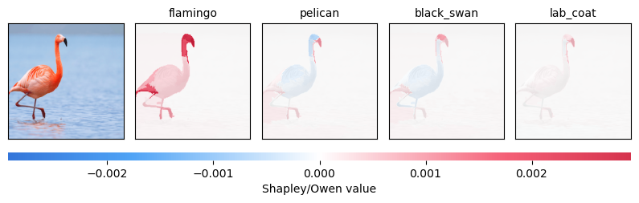
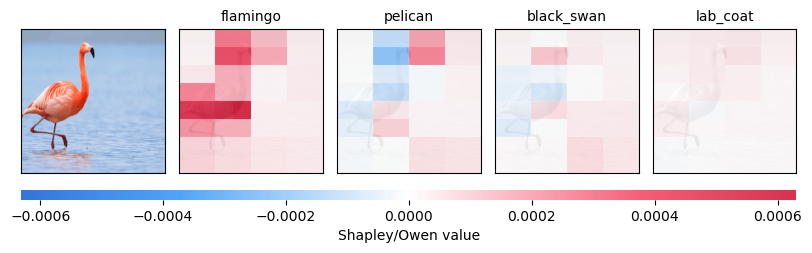

# ShapBPT: Shapley Image Explanations via Data-Aware Binary Partition Trees
### A python library to compute Shapley image explanations with data-aware Binary Partition Trees

---

ShapBPT is a Python library for generating **faithful, data-aware image explanations** based on **Owen values**, a structured variant of Shapley values.
Unlike classical SHAP partitioning, where features are grouped using *axis-aligned*, image-agnostic splits, ShapBPT constructs a **Binary Partition Tree (BPT)** that mirrors the *morphology* and *structure* of the image itself.
This leads to explanations aligned with meaningful visual regions rather than arbitrary pixel blocks.

<!-- ShapBPT is a novel eXplainable AI (XAI) method that computes the Owen approximation of the Shapley coefficients following a data-aware binary hierarchical coalition structure derived from the Binary Partition Tree computer vision algorithm.  -->

### Why ShapBPT? Key Advantages

 - **Model-agnostic**: ShapBPT only requires a *masking function*, not access to model internals.
 - **Data-aware explanation structure**: Explanations follow meaningful image segments derived from the BPT, improving interpretability.
 - **Computationally efficient Owen value approximation**: Uses hierarchical Owen value recursion to reduce evaluation cost.
 - **Drop-in replacement for SHAP Partition Explainer**: By selecting `method="AA"` you can reproduce SHAP’s axis-aligned partitioning within the same interface.


---

## What Is a Binary Partition Tree (BPT)?

A **Binary Partition Tree** is a hierarchical bottom-up segmentation of an image:

* start from individual pixels,
* iteratively merge adjacent regions that minimize a chosen distance metric,
* continue until a single root region is formed.

This hierarchy provides ShapBPT with a **data-aware coalition structure** used to compute Shapley feature attributions.
Where SHAP’s Partition Explainer uses *Axis-Aligned* splits, ShapBPT uses **morphological clusters** guided by the actual image content.

Because regions can be recursively split down to individual pixels, the method gracefully balances **efficiency** and **fidelity**.


<!-- A Binary Partition Tree (BPT) is a hierarchical binary partitioning of an image, that is performed bottom-up minimazing a data-aware distance function. -->
<center>

</center>
<!-- A BPT is conceptually similar to the approach of the [Partition Explainer of SHAP](https://shap-lrjball.readthedocs.io/en/latest/example_notebooks/partition_explainer/Partition.html), which uses Axis-Aligned (AA) partitions. Instead, ShapBPT works over a hierarchy that 
is data-aware. -->


### How it is built and used

A **Binary Partition Tree** is built bottom-up, starting from the individual pixels and then merging adjacent regions that minimize a distance function, until all regions are merged into a single cluster. The tree that forms is the BPT tree.

<center></center>

In practice, the BPT hierarchy is used top-down, starting from the root cluster and splitting adaptively.
ShapBPT uses the BPT hierarchy to generate feature attributions in the form of (Owen approximations) of the Shapley coefficients.
<center>


</center>
The ShapBPT python library follows the BPT hierachy to compute Shapley values.
The resulting explanation follows the morphological regions pre-identified by the BPT algorithm, and therefore works under the assumption that the explained regions are somewhat identified by relevant image features. If this assumption does not hold for a given region, then such region can be split up, until the individual pixels are reached.
<center>

</center>

# Using ShapBPT

### Step 1. Define a masking function
ShapBPT requires a function
$$
  \nu: N \times H \times W \rightarrow B \times M
$$
that takes in input a set of N binary masks and returns model predictions.

<!-- Consider a machine learning classifier $f$ with input
$$
    f : B \times Img \rightarrow B \times M
$$
where $B$ is the batch size, $M$ is the number of classes in the output probability distribution, and $Img$ is the image data. Image data could be, for instance, in CHW format (Channel, Height, Width) or in HWC format (Height, Width, Channel).

ShapBPT is a model-agnostic XAI method. 
It does not require any a-priori knowledge of the machine learning model internals. 
Instead, it relies on a masking function, i.e. a function with signature 
$$\nu: N \times H \times W \rightarrow B \times M$$
where $N$ is the batch size, $H \times W$ is the image size, and $M$ is the number of classes. -->

### Step 2. Run the explainer

```python
import shap_bpt

explainer = shap_bpt.Explainer(
    nu,                      # masking function ν
    image_to_explain,        # input image (HWC)
    num_explained_classes=4, # number of output classes to attribute
    verbose=True
)

shap_values = explainer.explain_instance(
    max_evals=eval_budget,   # maximum number of nu evaluations to generate the explanation 
    method="BPT",            # choose "BPT" (data-aware) or "AA" (axis-aligned)
    batch_size=batch_size
)
```

### Step 3. Visualize the attribution map

```python
shap_bpt.plot_owen_values(explainer, shap_values, class_names)
```

With `eval_budget=100` and `method='BPT'` we obtain the explanation:
<center></center>

With `eval_budget=100` and `method='AA'` we obtain the explanation:
<center></center>

See the provided notebooks for examples on how to setup and run ShapBPT.


<!-- Once the masking function is defined, an explanation can be built using the following code.
```python
import shap_bpt as shap_bpt
explainer = shap_bpt.Explainer(f_masked, image_to_explain, 
                               num_explained_classes=4, verbose=True)
shap_values = explainer.explain_instance(eval_budget, method='BPT', batch_size=batch_size)
``` -->

<!-- In this code, `nu` is the masking function $\nu$, and `eval_budget` is the maximum number of model evaluations allowed to generate the explanation.  -->

---

## How It Works: Owen Value Approximation

ShapBPT evaluates the **Owen value** over a BPT coalition structure. 
The library uses the formula
$$
    \widehat{\Omega}_i(Q, T) = 
    \begin{cases}
        \displaystyle
        \frac{1}{2} \widehat{\Omega}_i(Q \cup T_{2},\, T_{1}{\downarrow}) \,+\,
        \frac{1}{2} \widehat{\Omega}_i(Q,\, T_{1}{\downarrow}) \quad
        & \text{if}~T{\downarrow} = \{T_{1},\, T_{2}\}
        \\[4pt]
        \widehat{\varphi}_i(Q, T)
        & \text{otherwise}
        \\
    \end{cases}
$$
where $i \in T_{1}$, and $\widehat{\varphi}_i(Q, T) ~=~ \frac{1}{|T|} \Delta_{T}(Q)$ is the uniform marginal distribution of $T$ w.r.t. $Q$. 

This hierarchical structure is what makes ShapBPT **efficient**, especially compared to full Shapley enumeration.


<!-- The obtained Shapley values can be visualized using
```python
shap_bpt.plot_owen_values(explainer, shap_values, class_names)
``` -->

<!-- With `eval_budget=100` we obtain the explanation:
<center></center>
ShapBPT can also compute Axis Aligned explanations, using <code>method='AA'</code>.
AA explanations are conceptually identical to the expkanations obtained using the SHAP Partition Explainer. 

An example with `eval_budget100` is

<center></center>

See the provided notebooks for examples on how to setup and run ShapBPT. -->

<!-- # ShapBPT Programming Interface

The main object in the ShapBPT library is the `Explainer` class.
The constructor is
```python
shap_bpt.Explainer(fm, # masking function
                   image_to_explain, # image being explained, shape=(W*H*C)
                   num_explained_classes, # number of classes being explained
                   verbose=False) # verbosity, default False
```
Note that `fm` is the *masking function*, not the black-box model. 
The main method to generate the feature attributions is
```python
Explainer.explain_instance(max_evals, # budget in terms of model evaluations
                           method='BPT', # can be 'AA' or 'BPT'
                           bpt=None, # the BPT hierarchy (None=automatically generate it)
                           batch_size=64, # batch size
                           pbar=None, # progress bar
                           min_area=1, # minimum area of an indivisible partition (default 1)
                           max_weight=None) # maximum weight of an indivisible partition (default None)
```
The typical use is to set a `max_evals` budget, and compute the explanations.
It is also possible to use other stopping criteria, like the area of the regions before they become indivisible (default 1, cannot be less than 1), or the maximum weight (root is 1, every split multiplies by $\frac{1}{2}$). -->

---

## Installation

<!-- `ShapBPT` contains a `cython` module, that needs to be compiled separately, before installing. On Unix systems, run: -->
Because ShapBPT includes a **Cython module**, compiling is required.

### Unix systems
```
python setup.py build_ext --inplace
```

### Windows systems
On Windows, the package can be compiled using `ming32`, with the command:
```
python setup.py build_ext --inplace --compiler=mingw32
```

**Recommended:** To install mingw using conda commands recommended on [`this page`](https://python-at-risoe.pages.windenergy.dtu.dk/compiling-on-windows/configuration.html) to setup a working mingw32 system, Run following lines.
```cmd
conda install numpy libpython m2w64-toolchain cython
```
**Note**: *Make sure that environment having cython is activated before running above line of code*.

Alternativly, Follow the instruction on [`this page`](https://github.com/nuncjo/cython-installation-windows)

### Package installation (all systems)
After compiling, the ShapBPT python module can be installed using:
```
python setup.py install
```

To clean up the folder from the intermediate build files, use:
```
python setup.py clean --all
```

# Examples

- [ImageNet setup with BPT partitions](examples/ImageNET_BPT.ipynb)
- [ImageNet setup, AA and BPT partitions](examples/ImageNET_BPT.ipynb)
